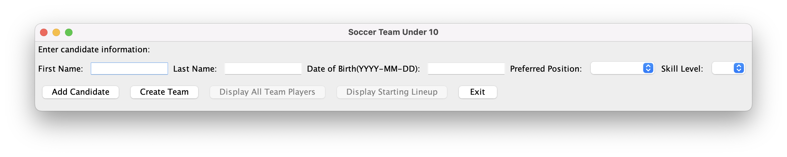
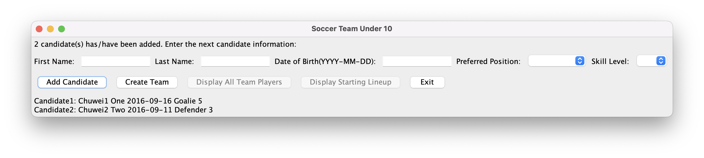
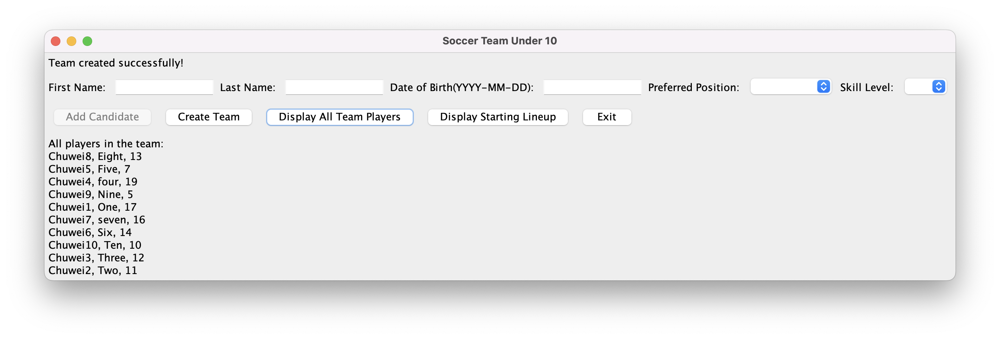
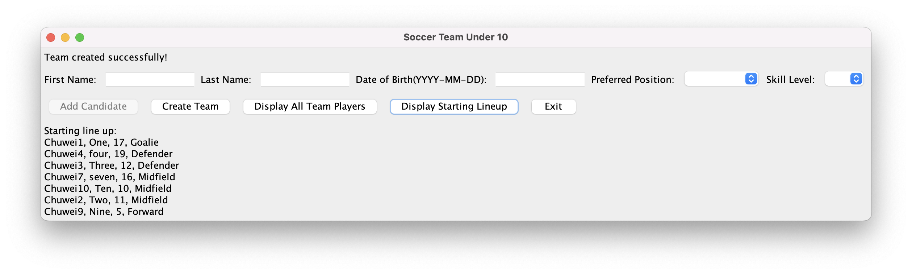
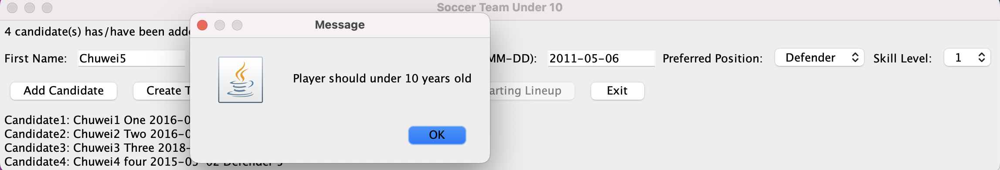
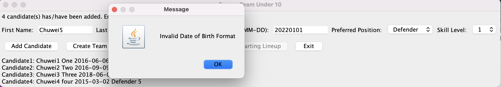
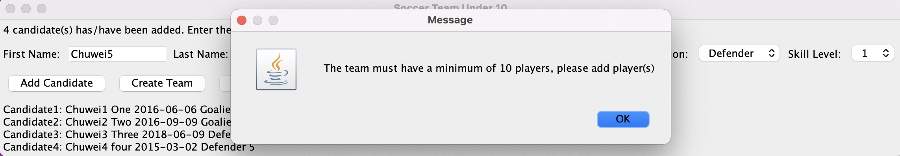

## 1. Overview. 
This program is designed to help the coach to manage a soccer team by allowing users to create a team, add candidate players, construct the team, and display player information. The program uses a Model-View-Controller (MVC) architecture. By providing a user-friendly GUI, the program enables users to interact with the create team model easily.
## 2. List of features. 
- Add candidate players with their first name, last name, date of birth, preferred position, and skill level.
- Construct a soccer team with a size between 10 and 20 players
- Display all players in the team, sorted alphabetically by last name, case insensitive. If players have the same name, they will be listed by the order they are entered in the system. Displayed information includes players' first name, last name, and their random unique jersey number.
- Display the starting lineup, sorted by position (goalie, defender, midfielder, forward) and alphabetically by last name within each position. Displayed information includes players' first name, last name, jersey number, and position.
- Handle exceptions and show appropriate error messages when needed, e.g. Players are older than 10 years old, or try to create team with less than 10 people.
- Exit the program

## 3. How To Run. 
- To run the file, open the project in Intellij, navigate to the res/ directory which contains the jar file called "soccer club.jar". Then, run the following command:
```sh
- java -jar soccer\ club.jar 
```
- No arguments are required to run the file.
- After running with the command, you will see window below pops up, which means you start the JAR file successfully.


## 4. How to Use the Program. 
1. once the window pops up, user can starts to enter candidates information into the text field. 

2. User is able to type in first name, lase name, and date of birth in "YYYY-MM-DD" format. Pasting text from clipbord is not supported. Prefered position and skill level can be selected from drop down menu.

3. After entered all information of a player, click on the "Add candidate" button to add this player as candidate. Player's information will be stored and listed below.


4. Keep adding candidate by repeating step 2 - 3.

5. Text on the top will indicate the number of candidates that user entered.

6. When there are more than or equal to 10 players are added, user can choose to start create team by clicking on the "Create team" button. Top text will indicate "team create successfully".

7. Once the team has been created, the add candidate button will turn gray and user is not able to add more candidates.
8. After creating the team, user is able to choose to see all team players by clicking on the "Display All Team Players" button, or players who are selected in the starting line up.


9. Select Exit button, or close the window to exit the program.

Error Message will pop up in the following situation:
1. If the date of birther indicates the player is older than 10 years old, an error message will pop up.



2. If incorrect date format or invalid date is entered in the date of birth text field, an error message will pop up.



3. An error message will pop up if user click on create team when there are not enough players to create a team.




## 5. Design/Model Changes. 
Several changes on CreateTeamModel class compared to project part 1:
1. Moved the isTeamCreated check from getTeamList() method to contructTeam() method, and removed two checks isJerseyAssign and isPositionAssigned in constructor and their application in metholds assignPosition() and assignJersey(). In the original design, there are three checks in three methods to ensure the team will not be re-created. By moving the check to contructTeam() method, one check is enough to get work done.
2. Added 7 Constants in the model constructor to define the team size and numbers of players in each type of position. Constant makes the program easier to be modified if the club decided to construt team with more or less number of players in a team or in starting line up.
3. UML has been updated to reflect above changes.


## 6. Assumptions. 
- All players should under 10 years old.
- Team has at least 10 players.
- Team has 20 players at most. If there are more than 20 candidates, candidates will be sorted by skill level from high to low and only top 20 will be selected into the team.
- Team will be created only one time. Once team has been created, the coach is not able to add other candidates.
- Candidates are selected to the team purely by skill level. 5 is the highest level and 1 is the lowest level.
- Jersey number is assigned randomly to team players, can not be modified/changed.
- Players are selected to starting line up purely by skill level.
- Positions are assigned based on player's preferred position. when preferred position is full, plyers will be randomly assign to rest positions.
- Players who have the same name, can be identified by date of birth.

## 7. Citations. 
A Visual Guide to Layout Managers (The Java&trade; Tutorials > Creating a GUI With Swing > Laying Out Components Within a Container). (n.d.). A Visual Guide to Layout Managers (the Java&Trade; Tutorials > Creating a GUI With Swing > Laying Out Components Within a Container). https://docs.oracle.com/javase/tutorial/uiswing/layout/visual.html